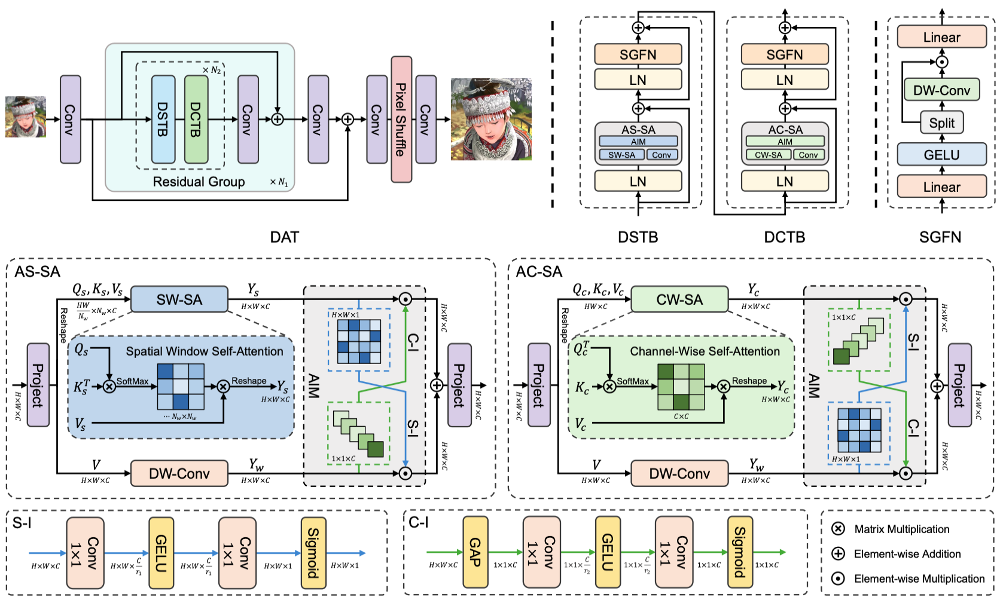
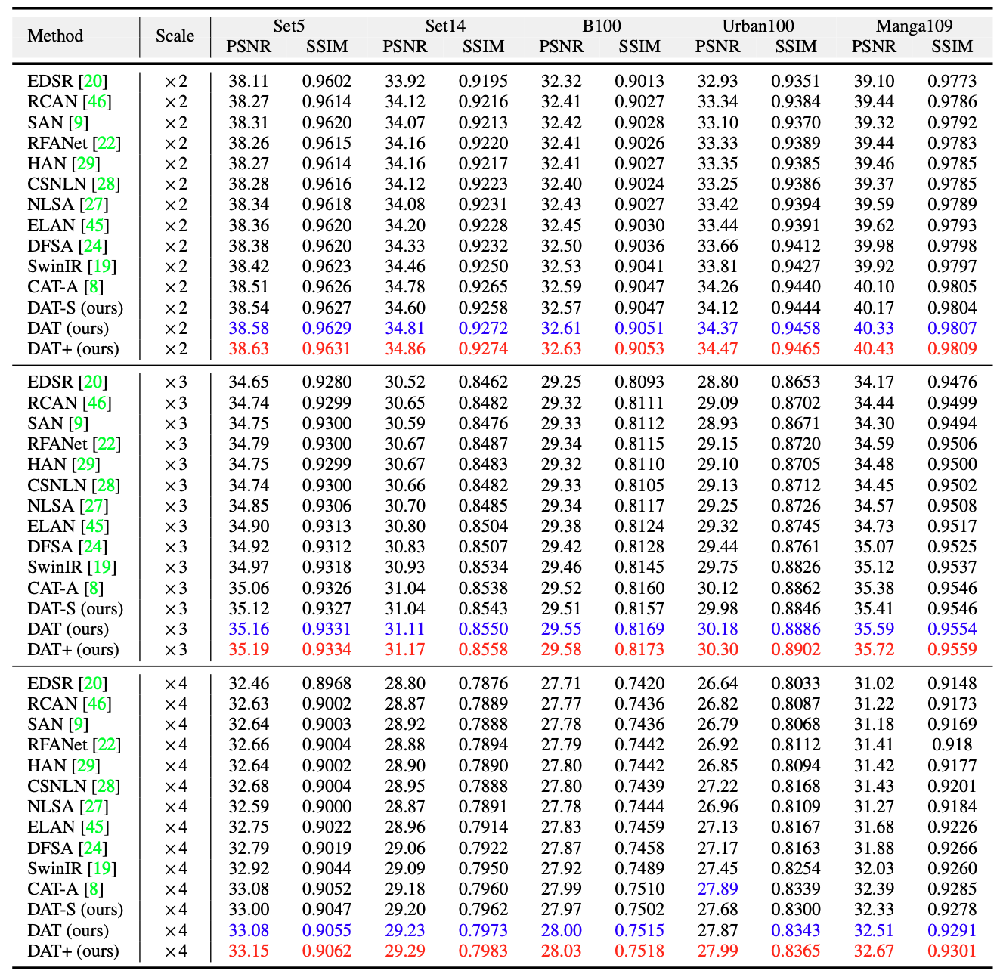
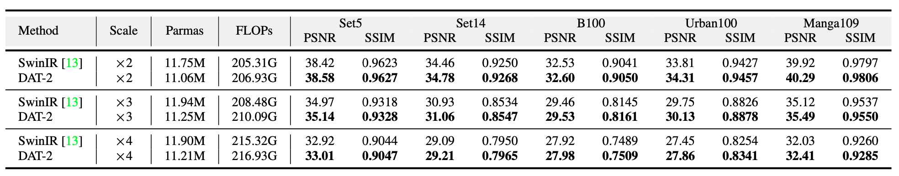
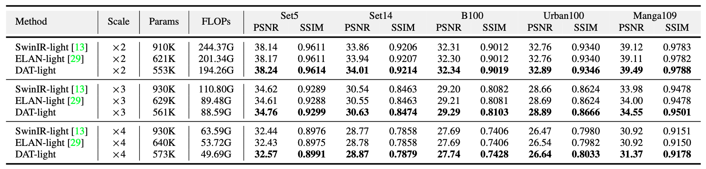
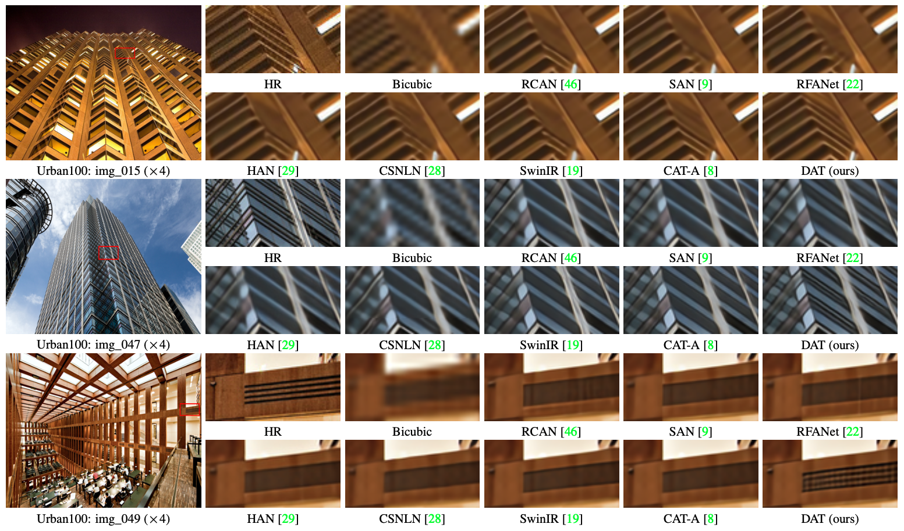
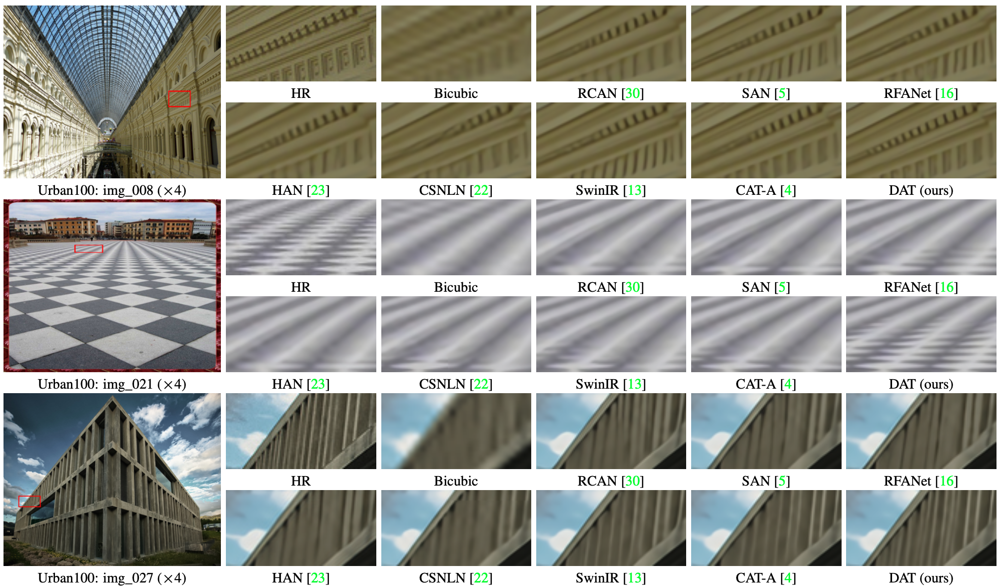
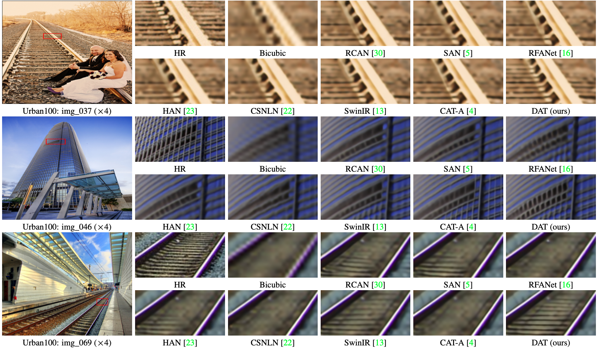
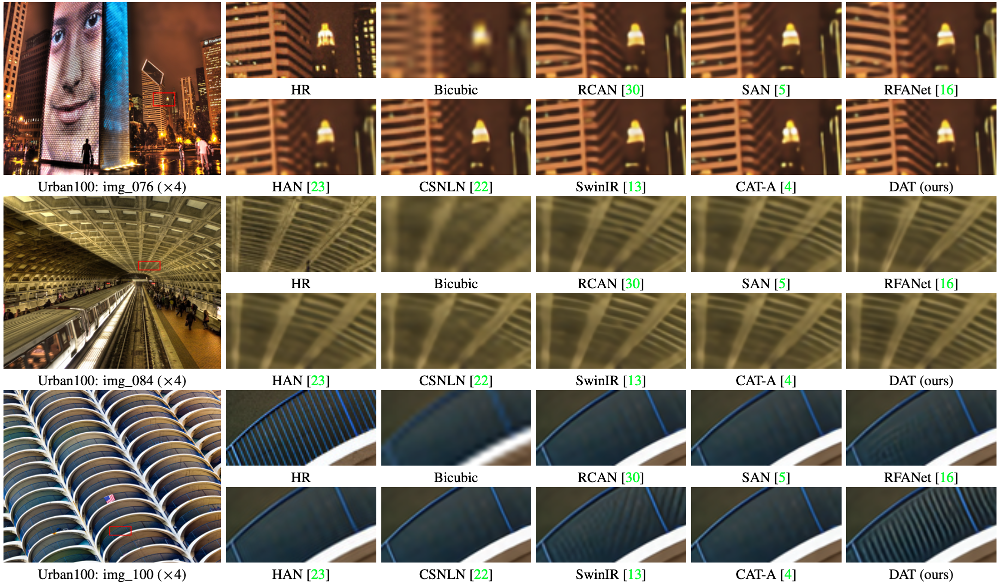
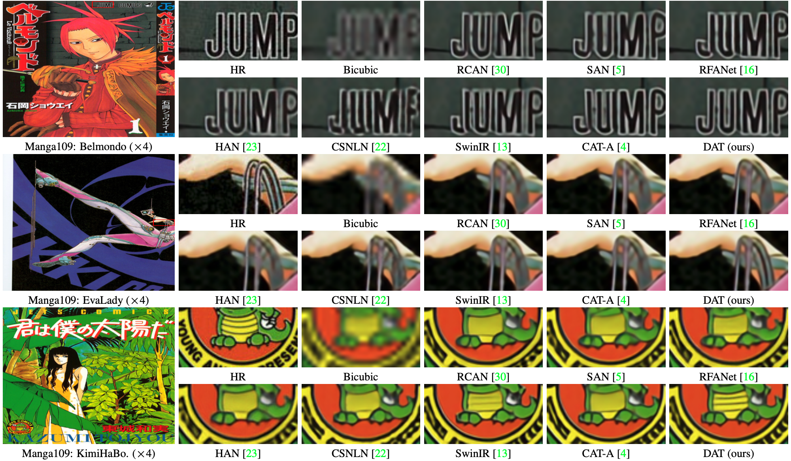

# Dual Aggregation Transformer for Image Super-Resolution

[Zheng Chen](https://zhengchen1999.github.io/), [Yulun Zhang](http://yulunzhang.com/), [Jinjin Gu](https://www.jasongt.com/), [Linghe Kong](https://www.cs.sjtu.edu.cn/~linghe.kong/), [Xiaokang Yang](https://scholar.google.com/citations?user=yDEavdMAAAAJ&hl), and [Fisher Yu](https://www.yf.io/), "Dual Aggregation Transformer for Image Super-Resolution", ICCV, 2023

[[paper](https://openaccess.thecvf.com/content/ICCV2023/papers/Chen_Dual_Aggregation_Transformer_for_Image_Super-Resolution_ICCV_2023_paper.pdf)] [[arXiv](http://arxiv.org/abs/2308.03364)] [[supplementary material](https://github.com/zhengchen1999/DAT/releases)] [[visual results](https://drive.google.com/drive/folders/1ZMaZyCer44ZX6tdcDmjIrc_hSsKoMKg2?usp=drive_link)] [[pretrained models](https://drive.google.com/drive/folders/1iBdf_-LVZuz_PAbFtuxSKd_11RL1YKxM?usp=drive_link)]

#### 🔥🔥🔥 News

- **2023-09-17:** The [chaiNNer](https://github.com/chaiNNer-org/chaiNNer) and the [neosr](https://github.com/muslll/neosr) add DAT support. Additional trained DAT models are available in [OpenMMLab](https://openmodeldb.info/?sort=date-desc&t=arch%3Adat) ([#11](https://github.com/zhengchen1999/DAT/issues/11)). Thank [Phhofm](https://github.com/Phhofm)!
- **2023-07-16:** This repo is released.
- **2023-07-14:** DAT is accepted at ICCV 2023. 🎉🎉🎉

---

> **Abstract:** *Transformer has recently gained considerable popularity in low-level vision tasks, including image super-resolution (SR). These networks utilize self-attention along different dimensions, spatial or channel, and achieve impressive performance. This inspires us to combine the two dimensions in Transformer for a more powerful representation capability. Based on the above idea, we propose a novel Transformer model, Dual Aggregation Transformer (DAT), for image SR. Our DAT aggregates features across spatial and channel dimensions, in the inter-block and intra-block dual manner. Specifically, we alternately apply spatial and channel self-attention in consecutive Transformer blocks. The alternate strategy enables DAT to capture the global context and realize inter-block feature aggregation. Furthermore, we propose the adaptive interaction module (AIM) and the spatial-gate feed-forward network (SGFN) to achieve intra-block feature aggregation. AIM complements two self-attention mechanisms from corresponding dimensions. Meanwhile, SGFN introduces additional non-linear spatial information in the feed-forward network. Extensive experiments show that our DAT surpasses current methods.* 



---

|                      HR                      |                        LR                         | [SwinIR](https://github.com/JingyunLiang/SwinIR) |  [CAT](https://github.com/zhengchen1999/CAT)  |                  DAT (ours)                   |
| :------------------------------------------: | :-----------------------------------------------: | :----------------------------------------------: | :-------------------------------------------: | :-------------------------------------------: |
|  |  |  |  |  |
|  |  |  |  |  |

## Dependencies

- Python 3.8
- PyTorch 1.8.0
- NVIDIA GPU + [CUDA](https://developer.nvidia.com/cuda-downloads)

```bash
# Clone the github repo and go to the default directory 'DAT'.
git clone https://github.com/zhengchen1999/DAT.git
conda create -n DAT python=3.8
conda activate DAT
pip install -r requirements.txt
python setup.py develop
```

## Contents

1. [Datasets](#Datasets)
1. [Models](#Models)
1. [Training](#Training)
1. [Testing](#Testing)
1. [Results](#Results)
1. [Citation](#Citation)
1. [Acknowledgements](#Acknowledgements)

---

## Datasets

Used training and testing sets can be downloaded as follows:

| Training Set                                                 |                         Testing Set                          |                        Visual Results                        |
| :----------------------------------------------------------- | :----------------------------------------------------------: | :----------------------------------------------------------: |
| [DIV2K](https://data.vision.ee.ethz.ch/cvl/DIV2K/) (800 training images, 100 validation images) +  [Flickr2K](https://cv.snu.ac.kr/research/EDSR/Flickr2K.tar) (2650 images) [complete training dataset DF2K: [Google Drive](https://drive.google.com/file/d/1TubDkirxl4qAWelfOnpwaSKoj3KLAIG4/view?usp=share_link) / [Baidu Disk](https://pan.baidu.com/s/1KIcPNz3qDsGSM0uDKl4DRw?pwd=74yc)] | Set5 + Set14 + BSD100 + Urban100 + Manga109 [complete testing dataset: [Google Drive](https://drive.google.com/file/d/1yMbItvFKVaCT93yPWmlP3883XtJ-wSee/view?usp=sharing) / [Baidu Disk](https://pan.baidu.com/s/1Tf8WT14vhlA49TO2lz3Y1Q?pwd=8xen)] | [Google Drive](https://drive.google.com/drive/folders/1ZMaZyCer44ZX6tdcDmjIrc_hSsKoMKg2?usp=drive_link) / [Baidu Disk](https://pan.baidu.com/s/1LO-INqy40F5T_coAJsl5qw?pwd=dqnv#list/path=%2F) |

Download training and testing datasets and put them into the corresponding folders of `datasets/`. See [datasets](datasets/README.md) for the detail of the directory structure.

## Models

| Method    | Params | FLOPs (G) | Dataset  | PSNR (dB) |  SSIM  |                          Model Zoo                           |                        Visual Results                        |
| :-------- | :----: | :-------: | :------: | :-------: | :----: | :----------------------------------------------------------: | :----------------------------------------------------------: |
| DAT-S     | 11.21M |  203.34   | Urban100 |   27.68   | 0.8300 | [Google Drive](https://drive.google.com/drive/folders/1hM0v3fUg5u6GjkI7dduxShyGgGfEwQXO?usp=drive_link) / [Baidu Disk](https://pan.baidu.com/s/1rgkCyqEJdZlHvQ6_Dwb3rA?pwd=4rfr) | [Google Drive](https://drive.google.com/file/d/1x1ixMswxw5w-zeZ_Rap5Nk4Tr46MIjAw/view?usp=drive_link) / [Baidu Disk](https://pan.baidu.com/s/1LO-INqy40F5T_coAJsl5qw?pwd=dqnv) |
| DAT       | 14.80M |  275.75   | Urban100 |   27.87   | 0.8343 | [Google Drive](https://drive.google.com/drive/folders/14VG5mw5ie8RrR4jjypeHynXDZYWL8w-r?usp=drive_link) / [Baidu Disk](https://pan.baidu.com/s/1rgkCyqEJdZlHvQ6_Dwb3rA?pwd=4rfr) | [Google Drive](https://drive.google.com/file/d/1K43CTsXpoX5St5fed4kEW9gu2KMR6hLu/view?usp=drive_link) / [Baidu Disk](https://pan.baidu.com/s/1LO-INqy40F5T_coAJsl5qw?pwd=dqnv) |
| DAT-2     | 11.21M |  216.93   | Urban100 |   27.86   | 0.8341 | [Google Drive](https://drive.google.com/drive/folders/1yV9LMhr2tYM_eHEIVY4Jw9X3bWGgorbD?usp=drive_link) / [Baidu Disk](https://pan.baidu.com/s/1rgkCyqEJdZlHvQ6_Dwb3rA?pwd=4rfr) | [Google Drive](https://drive.google.com/file/d/1TQRZIg8at5HX87OCu3GYytZhYGperkuN/view?usp=drive_link) / [Baidu Disk](https://pan.baidu.com/s/1LO-INqy40F5T_coAJsl5qw?pwd=dqnv) |
| DAT-light |  573K  |   49.69   | Urban100 |   26.64   | 0.8033 | [Google Drive](https://drive.google.com/drive/folders/105JRMN5VJbJ7EMQJdqmhDVMAFCaKYDl8?usp=drive_link) / [Baidu Disk](https://pan.baidu.com/s/1rgkCyqEJdZlHvQ6_Dwb3rA?pwd=4rfr) | [Google Drive](https://drive.google.com/file/d/1xKxK6_UcqAWK2m5znQX_LssWndmN-End/view?usp=drive_link) / [Baidu Disk](https://pan.baidu.com/s/1LO-INqy40F5T_coAJsl5qw?pwd=dqnv) |

The performance is reported on Urban100 (x4). DAT-S, DAT, DAT-2: output size of FLOPs is 3×512×512. DAT-light: output size of FLOPs is 3×1280×720. 

## Training

- Download [training](https://drive.google.com/file/d/1TubDkirxl4qAWelfOnpwaSKoj3KLAIG4/view?usp=share_link) (DF2K, already processed) and [testing](https://drive.google.com/file/d/1yMbItvFKVaCT93yPWmlP3883XtJ-wSee/view?usp=sharing) (Set5, Set14, BSD100, Urban100, Manga109, already processed) datasets, place them in `datasets/`.

- Run the following scripts. The training configuration is in `options/train/`.

  ```shell
  # DAT-S, input=64x64, 4 GPUs
  python -m torch.distributed.launch --nproc_per_node=4 --master_port=4321 basicsr/train.py -opt options/Train/train_DAT_S_x2.yml --launcher pytorch
  python -m torch.distributed.launch --nproc_per_node=4 --master_port=4321 basicsr/train.py -opt options/Train/train_DAT_S_x3.yml --launcher pytorch
  python -m torch.distributed.launch --nproc_per_node=4 --master_port=4321 basicsr/train.py -opt options/Train/train_DAT_S_x4.yml --launcher pytorch
  
  # DAT, input=64x64, 4 GPUs
  python -m torch.distributed.launch --nproc_per_node=4 --master_port=4321 basicsr/train.py -opt options/Train/train_DAT_x2.yml --launcher pytorch
  python -m torch.distributed.launch --nproc_per_node=4 --master_port=4321 basicsr/train.py -opt options/Train/train_DAT_x3.yml --launcher pytorch
  python -m torch.distributed.launch --nproc_per_node=4 --master_port=4321 basicsr/train.py -opt options/Train/train_DAT_x4.yml --launcher pytorch
  
  # DAT-2, input=64x64, 4 GPUs
  python -m torch.distributed.launch --nproc_per_node=4 --master_port=4321 basicsr/train.py -opt options/Train/train_DAT_2_x2.yml --launcher pytorch
  python -m torch.distributed.launch --nproc_per_node=4 --master_port=4321 basicsr/train.py -opt options/Train/train_DAT_2_x3.yml --launcher pytorch
  python -m torch.distributed.launch --nproc_per_node=4 --master_port=4321 basicsr/train.py -opt options/Train/train_DAT_2_x4.yml --launcher pytorch
  
  # DAT-light, input=64x64, 4 GPUs
  python -m torch.distributed.launch --nproc_per_node=4 --master_port=4321 basicsr/train.py -opt options/Train/train_DAT_light_x2.yml --launcher pytorch
  python -m torch.distributed.launch --nproc_per_node=4 --master_port=4321 basicsr/train.py -opt options/Train/train_DAT_light_x3.yml --launcher pytorch
  python -m torch.distributed.launch --nproc_per_node=4 --master_port=4321 basicsr/train.py -opt options/Train/train_DAT_light_x4.yml --launcher pytorch
  ```

- The training experiment is in `experiments/`.

## Testing

### Test images with HR

- Download the pre-trained [models](https://drive.google.com/drive/folders/1iBdf_-LVZuz_PAbFtuxSKd_11RL1YKxM?usp=drive_link) and place them in `experiments/pretrained_models/`.

  We provide pre-trained models for image SR: DAT-S, DAT, DAT-2, and DAT-light (x2, x3, x4).

- Download [testing](https://drive.google.com/file/d/1yMbItvFKVaCT93yPWmlP3883XtJ-wSee/view?usp=sharing) (Set5, Set14, BSD100, Urban100, Manga109) datasets, place them in `datasets/`.

- Run the following scripts. The testing configuration is in `options/test/` (e.g., [test_DAT_x2.yml](options/Test/test_DAT_x2.yml)).

  Note 1:  You can set `use_chop: True` (default: False) in YML to chop the image for testing.

  ```shell
  # No self-ensemble
  # DAT-S, reproduces results in Table 2 of the main paper
  python basicsr/test.py -opt options/Test/test_DAT_S_x2.yml
  python basicsr/test.py -opt options/Test/test_DAT_S_x3.yml
  python basicsr/test.py -opt options/Test/test_DAT_S_x4.yml
  
  # DAT, reproduces results in Table 2 of the main paper
  python basicsr/test.py -opt options/Test/test_DAT_x2.yml
  python basicsr/test.py -opt options/Test/test_DAT_x3.yml
  python basicsr/test.py -opt options/Test/test_DAT_x4.yml
  
  # DAT-2, reproduces results in Table 1 of the supplementary material
  python basicsr/test.py -opt options/Test/test_DAT_2_x2.yml
  python basicsr/test.py -opt options/Test/test_DAT_2_x3.yml
  python basicsr/test.py -opt options/Test/test_DAT_2_x4.yml
  
  # DAT-light, reproduces results in Table 2 of the supplementary material
  python basicsr/test.py -opt options/Test/test_DAT_light_x2.yml
  python basicsr/test.py -opt options/Test/test_DAT_light_x3.yml
  python basicsr/test.py -opt options/Test/test_DAT_light_x4.yml
  ```

- The output is in `results/`.

### Test images without HR

- Download the pre-trained [models](https://drive.google.com/drive/folders/1iBdf_-LVZuz_PAbFtuxSKd_11RL1YKxM?usp=drive_link) and place them in `experiments/pretrained_models/`.

  We provide pre-trained models for image SR: DAT-S, DAT, and DAT-2 (x2, x3, x4).

- Put your dataset (single LR images) in `datasets/single`. Some test images are in this folder.

- Run the following scripts. The testing configuration is in `options/test/` (e.g., [test_single_x2.yml](options/Test/test_single_x2.yml)).

  Note 1: The default model is DAT. You can use other models like DAT-S by modifying the YML.

  Note 2:  You can set `use_chop: True` (default: False) in YML to chop the image for testing.

  ```shell
  # Test on your dataset
  python basicsr/test.py -opt options/Test/test_single_x2.yml
  python basicsr/test.py -opt options/Test/test_single_x3.yml
  python basicsr/test.py -opt options/Test/test_single_x4.yml
  ```

- The output is in `results/`.

## Results

We achieved state-of-the-art performance. Detailed results can be found in the paper. All visual results of DAT can be downloaded [here](https://drive.google.com/drive/folders/1ZMaZyCer44ZX6tdcDmjIrc_hSsKoMKg2?usp=drive_link).

<details>
<summary>Click to expand</summary>

- results in Table 2 of the main paper

<p align="center">
  
</p>


- results in Table 1 of the supplementary material

<p align="center">
  
</p>


- results in Table 2 of the supplementary material

<p align="center">
  
</p>


- visual comparison (x4) in the main paper

<p align="center">
  
</p>


- visual comparison (x4) in the supplementary material

<p align="center">
  
  
  
  
</p>
</details>

## Citation

If you find the code helpful in your research or work, please cite the following paper(s).

```
@inproceedings{chen2023dual,
    title={Dual Aggregation Transformer for Image Super-Resolution},
    author={Chen, Zheng and Zhang, Yulun and Gu, Jinjin and Kong, Linghe and Yang, Xiaokang and Yu, Fisher},
    booktitle={ICCV},
    year={2023}
}
```

## Acknowledgements

This code is built on  [BasicSR](https://github.com/XPixelGroup/BasicSR).
